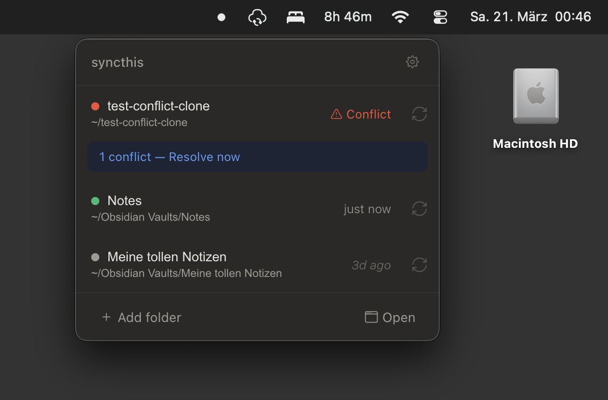
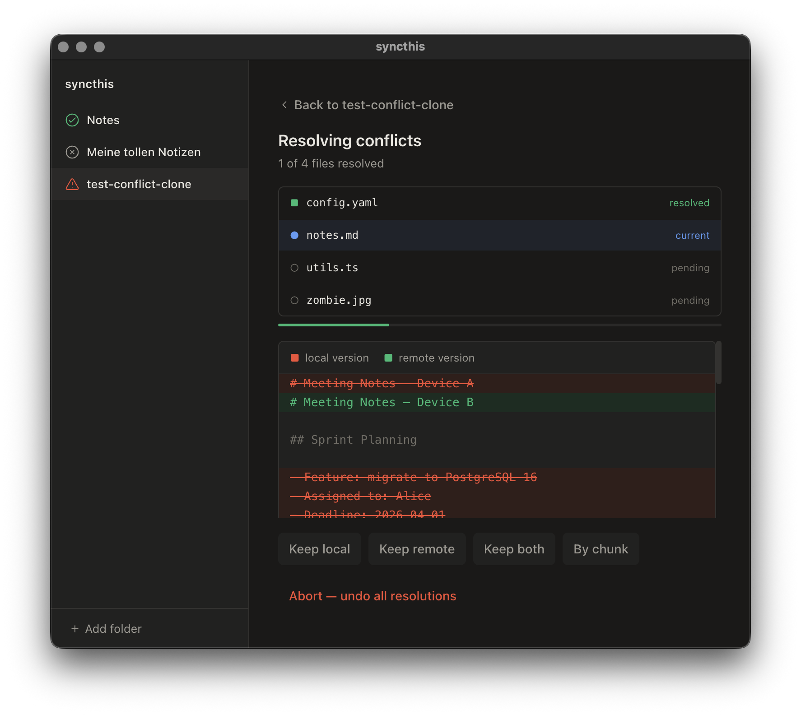
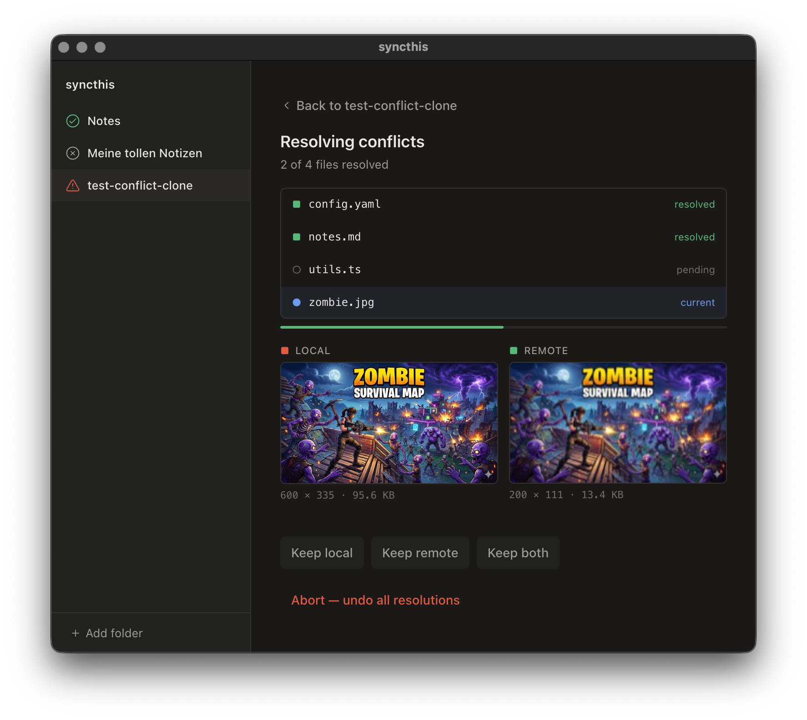

[](https://github.com/mischah/syncthis/releases)
[](https://github.com/mischah/syncthis/actions/workflows/ci.yml)
[](LICENSE)
[](https://github.com/sponsors/mischah)

#  syncthis

> Automatic directory synchronization via Git.

Keep your files in sync across devices — no manual Git needed. Primary use case: [Obsidian](https://obsidian.md) vault synchronization.

## Desktop App

syncthis runs as a tray app that sits in your menu bar. Connect your GitHub account, pick a repository, choose a local folder, and your files stay in sync automatically.



### Features

**Visual conflict resolution** — When the same file is edited on two devices, resolve conflicts with a side-by-side diff view:




**Dashboard** — Monitor sync health, view activity, and manage settings:


**Setup wizard** — Connect GitHub, pick a repo, choose a folder — done:


### Prerequisites

- A [GitHub](https://github.com) account (free)
- [Git](https://git-scm.com/downloads) installed (CLI only — the desktop app includes Git)

New to Git? Follow the [Obsidian Setup Guide](docs/obsidian-setup-guide.md) for a step-by-step walkthrough.

### Download

Download the latest release from [GitHub Releases](https://github.com/mischah/syncthis/releases).

| Platform | Format |
|----------|--------|
| macOS | DMG (arm64 + x64) |
| Linux | deb |

---

## Command Line

syncthis is also available as a CLI tool:

```bash
npm install -g syncthis
syncthis init --remote git@github.com:yourname/vault.git
syncthis start
```

See the [CLI documentation](packages/cli/README.md) or the [npm page](https://www.npmjs.com/package/syncthis) for full details.

---

## How It Works

On a configurable schedule (default: every 5 minutes), syncthis commits local changes, pulls remote changes via rebase, and pushes — fully automatic. Conflicts are detected and resolved based on your chosen [strategy](docs/Conflict-Strategies.md). See [How It Works](docs/How-It-Works.md) for the full sync cycle.

---

## Documentation

- [Obsidian Setup Guide](docs/obsidian-setup-guide.md) — Step-by-step for new users
- [CLI Reference](docs/CLI-Reference.md) — All commands and flags
- [Conflict Strategies](docs/Conflict-Strategies.md) — How conflicts are handled
- [How It Works](docs/How-It-Works.md) — Sync cycle and service lifecycle
- [Development](docs/Development.md) — Dev setup and project structure

---

## Support

If you find syncthis useful, consider supporting its development:

- [GitHub Sponsors](https://github.com/sponsors/mischah)
- [PayPal](https://paypal.me/dazzlingtone)

---

## License

[MIT](LICENSE)
