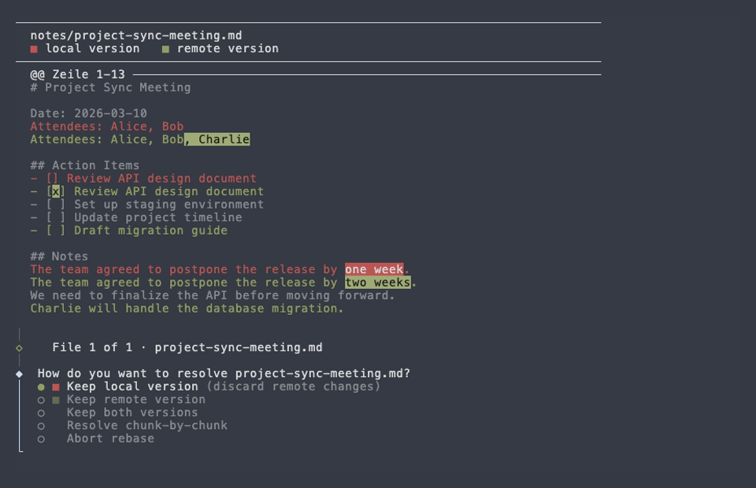

[](https://www.npmjs.com/package/syncthis)
[](LICENSE)
[](https://github.com/mischah/syncthis/actions/workflows/ci.yml)
[](https://codecov.io/gh/mischah/syncthis)

# syncthis

> Automatic directory synchronization via Git.

Commits, pulls, and pushes your changes on a configurable schedule — no manual `git` commands needed. Runs as a background service managed by your OS.

**Primary use case:** Keep your [Obsidian](https://obsidian.md) vault in sync across multiple devices.

### Smart Conflict Resolution

When the same file is edited on two devices, syncthis detects the conflict and lets you resolve it interactively — with a word-level diff and per-hunk granularity:



---

## Table of Contents

- [Quick Start for Obsidian Users](#quick-start-for-obsidian-users)
- [Installation](#installation)
- [Commands](#commands)
  - [syncthis init](#syncthis-init)
  - [syncthis start](#syncthis-start)
  - [syncthis stop](#syncthis-stop)
  - [syncthis status](#syncthis-status)
  - [syncthis health](#syncthis-health)
  - [syncthis list](#syncthis-list)
  - [syncthis logs](#syncthis-logs)
  - [syncthis uninstall](#syncthis-uninstall)
  - [Machine-readable output (--json)](#machine-readable-output---json)
- [How It Works](#how-it-works)
  - [Conflict Strategies](#conflict-strategies)
- [Configuration](#configuration)
- [Logging](#logging)
- [Development](#development)
- [Future Ideas](#future-ideas)
- [License](#license)

---

## Quick Start for Obsidian Users

> Not a developer? This section is for you. Brand new to Git and the terminal? Follow our [step-by-step Wiki tutorial](https://github.com/mischah/syncthis/wiki/Obsidian-Sync-Setup-Guide) instead. If you're comfortable with the terminal, skip to [Installation](#installation).

**What syncthis does:** It runs in the background and automatically commits and syncs your Obsidian vault to a private Git repository (e.g. on GitHub). This keeps your notes in sync across all your devices — without any manual steps.

**Prerequisites:**

1. **Git** installed — check with `git --version` in your terminal. If missing, [download it here](https://git-scm.com/downloads).
2. **Node.js 20+** installed — check with `node --version`. If missing, [download it here](https://nodejs.org).
3. A **private GitHub repository** created for your vault (e.g. `github.com/yourname/my-vault`). See [Creating a repository](https://docs.github.com/en/repositories/creating-and-managing-repositories/creating-a-new-repository) — make sure to select **Private**.
4. **SSH access to GitHub** configured — follow [GitHub's SSH guide](https://docs.github.com/en/authentication/connecting-to-github-with-ssh) if you haven't done this yet.

**Setup (one-time, takes ~2 minutes).** Open a terminal (macOS: Terminal.app via Spotlight; Linux: Ctrl+Alt+T) and run:

```bash
# 1. Install syncthis
npm install -g syncthis

# 2. Go to your vault folder
cd /path/to/your/obsidian-vault

# 3. Initialize — links your vault to your GitHub repo
syncthis init --remote git@github.com:yourname/my-vault.git

# 4. Start syncing in the background (every 5 minutes by default)
syncthis start
```

That's it. You can close the terminal — syncthis runs as a background service managed by your OS. On your other devices, repeat steps 2–4 using `--clone` instead of `--remote`:

```bash
# On your second device: clone and start syncing
syncthis init --clone git@github.com:yourname/my-vault.git --path /path/to/vault
syncthis start
```

**Check the status anytime:**

```bash
syncthis status
```

**Stop syncing:**

```bash
syncthis stop
```

---

## Installation

```bash
npm install -g syncthis
```

Or run without installing:

```bash
npx syncthis init --remote git@github.com:yourname/vault.git
```

**Requirements:** Node.js ≥ 20.0.0, Git installed and accessible in `PATH`.

**Supported platforms:** macOS (launchd), Linux (systemd).

---

## Commands

### `syncthis init`

Initializes a directory for syncing. Two modes:

**Mode A — Initialize an existing directory:**

```bash
syncthis init --remote git@github.com:user/vault.git
syncthis init --remote git@github.com:user/vault.git --path /home/user/my-vault
```

- Runs `git init` if the directory is not already a Git repo.
- Adds the remote as `origin`.
- Creates `.syncthis.json` with default configuration.
- Creates a `.gitignore` with Obsidian-specific defaults (only if none exists).
- Makes an initial commit if there are untracked files.

**Mode B — Clone a remote repository:**

```bash
syncthis init --clone git@github.com:user/vault.git
syncthis init --clone git@github.com:user/vault.git --path ./my-vault
```

- Clones the repository into the target directory.
- Creates `.syncthis.json`.

**Flags:**

| Flag | Type | Description |
|------|------|-------------|
| `--remote` | string | Remote URL (Mode A) |
| `--clone` | string | Repository URL to clone (Mode B) |
| `--path` | string | Target directory. Default: current directory |
| `--branch` | string | Branch name. Default: `main` |
| `--json` | boolean | Output machine-readable JSON. |

`--remote` and `--clone` are mutually exclusive.

---

### `syncthis start`

Installs (if needed) and starts the background sync service. This is the primary way to run syncthis — the OS handles starting, stopping, and restarting the process for you.

```bash
syncthis start
syncthis start --path ~/vault
syncthis start --label my-vault
syncthis start --enable-autostart
syncthis start --all
```

- Creates an OS service (launchd on macOS, systemd on Linux).
- Starts syncing immediately in the background.
- If a service already exists and is running: does nothing (idempotent).
- The service auto-restarts if it crashes unexpectedly.

**Flags:**

| Flag | Type | Description |
|------|------|-------------|
| `--path` | string | Directory to sync. Default: current directory |
| `--label` | string | Custom service name. Default: derived from directory path |
| `--enable-autostart` | boolean | Start automatically on login. Default: `false` |
| `--cron` | string | Cron expression. Persisted in the service definition. |
| `--interval` | number | Interval in seconds. Persisted in the service definition. |
| `--on-conflict` | string | Conflict strategy: `auto-both`, `auto-newest`, `stop`, `ask`. Default: `auto-both` |
| `--log-level` | string | `debug`, `info`, `warn`, `error`. Default: `info` |
| `--foreground` | boolean | Run in foreground instead of as a service (see below). |
| `--no-notify` | boolean | Disable desktop notifications. Default: notifications enabled |
| `--all` | boolean | Start all registered services. Mutually exclusive with `--path`, `--label`, `--foreground`. |
| `--json` | boolean | Output machine-readable JSON. Incompatible with `--foreground`. |

`--cron` and `--interval` are mutually exclusive. CLI flags take priority over `.syncthis.json`.

#### Foreground mode

Use `syncthis start --foreground` to run the sync loop attached to the terminal. The process stops when the terminal is closed.

```bash
syncthis start --foreground
syncthis start --foreground --path /home/user/my-vault
syncthis start --foreground --cron "*/5 * * * *"
syncthis start --foreground --interval 300
```

> Use foreground mode when you want to see live output for debugging, or in environments without a service layer (e.g. Docker containers).

---

### `syncthis stop`

Stops the background sync service. The service stays installed and can be restarted with `syncthis start`.

```bash
syncthis stop
syncthis stop --path ~/vault
syncthis stop --all
```

**Flags:**

| Flag | Type | Description |
|------|------|-------------|
| `--path` | string | Directory to stop. Default: current directory |
| `--all` | boolean | Stop all registered services. Mutually exclusive with `--path`. |
| `--json` | boolean | Output machine-readable JSON. |

---

### `syncthis status`

Shows the current sync status of a directory, including config, Git info, and service state.

```bash
syncthis status
syncthis status --path /home/user/my-vault
syncthis status --all
```

**Output includes:**

- Whether `.syncthis.json` exists and is valid.
- Whether a sync process is currently running (with PID).
- Git info: branch, remote URL, number of uncommitted changes, last commit.
- Service status: running/stopped/not installed, label, autostart.
- Health summary: `healthy`, `degraded`, or `unhealthy` with time of last sync.

Works even without `.syncthis.json` (shows "Not initialized"). With `--all`, shows a summary table of all registered services.

**Flags:**

| Flag | Type | Description |
|------|------|-------------|
| `--path` | string | Directory to inspect. Default: current directory |
| `--all` | boolean | Show status of all registered services. Mutually exclusive with `--path`. |
| `--json` | boolean | Output machine-readable JSON. |
| `--stale` | boolean | Include services with missing directories. |

---

### `syncthis health`

Shows whether the service is actively syncing — not just that the process is alive. Reads `.syncthis/health.json` written by the sync process after each cycle.

```bash
syncthis health
syncthis health --path ~/vault
syncthis health --all
syncthis health --json
```

**Status levels:**

| Status | Meaning |
|--------|---------|
| `healthy` | Process running, last sync successful, not overdue |
| `degraded` | Process running but sync overdue or consecutive failures |
| `unhealthy` | Process not running, ≥5 consecutive failures, or stuck conflict |

**Example output:**

```
Health: healthy ✓
  Last sync:    2m ago (synced)
  Uptime:       3h 12m
  Failures:     0 consecutive
  Sync cycles:  47
```

**Flags:**

| Flag | Type | Description |
|------|------|-------------|
| `--path` | string | Directory to check. Default: current directory |
| `--all` | boolean | Show health of all registered services. Mutually exclusive with `--path`. |
| `--json` | boolean | Output machine-readable JSON. |

---

### `syncthis list`

Lists all registered syncthis services on the system.

```bash
syncthis list
syncthis list --json
```

**Example output:**

```
Label        Status   PID   Schedule       Autostart  Path
vault-notes  running  1234  */5 * * * *    off        /home/user/vault-notes
work-notes   stopped  -     */5 * * * *    on         /home/user/work/notes
```

---

### `syncthis logs`

Shows the sync log output.

```bash
syncthis logs                    # Last 50 lines
syncthis logs --follow           # Live output (Ctrl+C to stop)
syncthis logs --lines 100        # Last 100 lines
```

---

### `syncthis uninstall`

Stops and completely removes the service from the OS.

```bash
syncthis uninstall
syncthis uninstall --path ~/vault
syncthis uninstall --all
```

Your files, `.syncthis.json`, and logs are not deleted — only the OS service registration is removed.

**Flags:**

| Flag | Type | Description |
|------|------|-------------|
| `--path` | string | Directory to uninstall. Default: current directory |
| `--all` | boolean | Uninstall all registered services. Mutually exclusive with `--path`. |
| `--json` | boolean | Output machine-readable JSON. |

---

### `syncthis resolve`

Interactively resolves a paused rebase conflict left by the `ask` strategy when running in a non-TTY environment (e.g. background service).

```bash
syncthis resolve
syncthis resolve --path ~/vault
```

- Shows a word-level diff for each conflicting file.
- Prompts you to choose `local`, `remote`, `both`, `chunk-by-chunk`, or `abort` per file.
- Continues the rebase after each resolution step.
- Pushes to the remote once all conflicts are resolved.

**Flags:**

| Flag | Type | Description |
|------|------|-------------|
| `--path` | string | Directory to resolve. Default: current directory |

### Machine-readable output (`--json`)

Pass `--json` to any command (except `resolve` and `logs`) to receive structured JSON output instead of human-readable text. Useful for scripting or integrations.

**Not supported on:** `resolve`, `logs`. Incompatible with `start --foreground`.

**Success response:**

```json
{ "ok": true, "command": "status", "data": { ... } }
```

**Error response:**

```json
{ "ok": false, "command": "start", "error": { "message": "Not initialized", "code": "NOT_INITIALIZED" } }
```

The process exits with code `0` on success and `1` on error, regardless of `--json`.

**Example:**

```bash
syncthis status --json | jq '.data.service.status'
syncthis start --all --json | jq '.data[] | select(.outcome == "failed")'
```

---

## How It Works

### Sync cycle

Every sync cycle follows these steps:

```
                Scheduled trigger
                      │
                      ▼
          ┌───────────────────────┐          ┌────────────────────────┐
          │  Rebase in progress?  ├── Yes ──►│      Sync skipped;     │
          └───────────┬───────────┘          │ run `syncthis resolve` │
                     Nope                    └────────────────────────┘
                      │
                      ▼
              ┌───────────────────┐
              │    git status     │
              └───┬───────────┬───┘
                  │           │
               Changes     No changes
                  │           │
                  │           ▼
                  │  ┌───────────────────┐      ┌──────────────────┐
                  │  │ git pull --rebase ├─────►│   Sync paused /  │
                  │  └─────────┬─────────┘ Err  │ retry next cycle │
                  │           OK                └──────────────────┘
                  │            │
                  │            ▼
                  │    ┌───────────────────┐
                  │    │   HEAD changed?   │
                  │    └────┬─────────┬────┘
                  │        Yes       Nope
                  │         │         │
                  │         ▼         ▼
                  │    ┌────────┐  ┌───────┐
                  │    │ Pulled │  │ No-op │
                  │    └────────┘  └───────┘
                  ▼
          ┌───────────────┐
          │  git add -A   │
          └───────┬───────┘
                  │
                  ▼
          ┌───────────────────┐
          │  git commit       │
          └───────┬───────────┘
                  │
                  ▼
          ┌───────────────────┐               ┌──────────────────┐
          │ git pull --rebase ├──── Err ─────►│   Sync paused /  │
          └───────┬───────────┘               │ retry next cycle │
                 OK                           └──────────────────┘
                  │
                  ▼
          ┌──────────────────┐               ┌──────────────────┐
          │  git push        ├─ Net error ──►│   Log warning,   │
          └───────┬──────────┘               │ retry next cycle │
                 OK                          └──────────────────┘
                  │
                  ▼
            ┌──────────┐
            │   Done   │
            └──────────┘
```

**Conflict handling:** When a rebase conflict occurs during `git pull --rebase`, syncthis handles it according to the `onConflict` setting (see [Conflict Strategies](#conflict-strategies) below).

**Offline support:** If the network is unavailable, the local commit succeeds. The pull and push failures are logged as warnings, and the loop continues. Everything syncs on the next successful cycle.

**Single instance:** A `.syncthis.lock` file prevents multiple instances from running against the same directory. Stale locks (left by a crash) are detected automatically by checking the recorded PID.

### Service lifecycle

When using `syncthis start`, the OS manages the sync process:

- **macOS:** Registered as a launchd LaunchAgent (`~/Library/LaunchAgents/`). The service runs `syncthis start --foreground` internally — launchd handles daemonization.
- **Linux:** Registered as a systemd user unit (`~/.config/systemd/user/`). Uses `systemctl --user` for management.

The OS auto-restarts the service on unexpected exits (crash, rebase conflict after manual resolution). Graceful stops via `syncthis stop` or `SIGTERM` are not restarted.

> **Linux note:** For the service to keep running after logout, user lingering must be enabled: `loginctl enable-linger $USER` (may require sudo). syncthis warns you if this isn't configured.

### Conflict Strategies

Configure how syncthis handles merge conflicts with `onConflict` in `.syncthis.json` or `--on-conflict` on the command line.

#### `auto-both` (default)

Keeps both versions — no data is lost:

- The **original file** retains your local version.
- The **remote version** is saved alongside it as a conflict copy.

Conflict copy filename pattern: `<name>.conflict-YYYY-MM-DDTHH-MM-SS.<ext>`

Examples:

- `note.md` → `note.conflict-2025-03-04T14-30-00.md`
- `archive.tar.gz` → `archive.tar.conflict-2025-03-04T14-30-00.gz`

Both files are committed and pushed, so the conflict copy appears on all devices. Review and delete conflict copies manually when you're done.

#### `auto-newest`

Automatically keeps the version with the newer Git commit timestamp. The older version is discarded.

- If timestamps are equal, falls back to `auto-both` (creates a conflict copy).
- No user action required.

#### `stop`

Stops the sync loop immediately and exits with code 1. Resolve the conflict manually:

```bash
cd /path/to/vault
git status            # see conflicting files
# edit files, then:
git add -A
git rebase --continue
syncthis start
```

#### `ask`

Pauses the sync and prompts you interactively to resolve each conflict:

- **In foreground / TTY mode:** Shows a word-level diff and prompts you inline to choose per file: `local` / `remote` / `both` / `chunk-by-chunk` / `abort`. The chunk-by-chunk mode lets you decide individually for each diff hunk.
- **In background service mode (non-TTY):** The rebase is left open. Run `syncthis resolve` in the same directory to complete resolution interactively.

---

## Configuration

`syncthis init` creates a `.syncthis.json` in the synced directory:

```json
{
  "remote": "git@github.com:user/vault.git",
  "branch": "main",
  "cron": "*/5 * * * *",
  "interval": null,
  "onConflict": "auto-both"
}
```

| Field | Type | Required | Default | Description |
|-------|------|----------|---------|-------------|
| `remote` | string | Yes | — | Remote repository URL |
| `branch` | string | No | `"main"` | Branch to sync |
| `cron` | string \| null | No | `"*/5 * * * *"` | Cron expression |
| `interval` | number \| null | No | `null` | Interval in seconds (≥ 10) |
| `onConflict` | string | No | `"auto-both"` | Conflict strategy: `auto-both`, `auto-newest`, `stop`, `ask` |

Exactly one of `cron` or `interval` must be set. CLI flags always override the config file.

**Common cron expressions:**

| Expression | Meaning |
|------------|---------|
| `*/5 * * * *` | Every 5 minutes (default) |
| `*/1 * * * *` | Every minute |
| `0 * * * *` | Every hour |

Or use `--interval` for a simple seconds-based schedule:

```bash
syncthis start --interval 60   # every 60 seconds
```

---

## Logging

Logs are written to both **stdout** and **`.syncthis/logs/syncthis.log`** in the synced directory.

**Format:**
```
[2025-02-20T14:30:00.000Z] [INFO]  Sync started. Schedule: */5 * * * *. Watching: /home/user/vault
[2025-02-20T14:35:00.000Z] [INFO]  Sync cycle: 3 files changed, committed, pushed.
[2025-02-20T14:40:00.000Z] [WARN]  Push failed: Network unreachable. Will retry next cycle.
[2025-02-20T14:45:00.000Z] [ERROR] Rebase conflict detected. Sync paused. Resolve conflicts manually.
```

Control log verbosity with `--log-level`:

```bash
syncthis start --foreground --log-level debug   # verbose output
syncthis start --foreground --log-level warn    # warnings and errors only
```

**Service mode logging:** In addition to the app log file, stdout/stderr are captured by the OS service layer. On macOS, these are stored in `.syncthis/logs/launchd-stdout.log` and `.syncthis/logs/launchd-stderr.log`. On Linux, they go to the systemd journal and can be viewed with `journalctl --user -u syncthis-<label>`. Use `syncthis logs` as a shortcut.

---

## Development

### Setup

```bash
git clone git@github.com:mischah/syncthis.git
cd syncthis
npm install
```

### Useful Scripts

| Command | Description |
|---------|-------------|
| `npm run dev -w packages/cli -- -- --help` | Run CLI in dev mode |
| `npm test` | Run all tests |
| `npm run build` | Build `dist/cli.js` |
| `npm run lint` | Lint and check formatting |
| `npm run lint:fix` | Auto-fix lint and formatting issues |
| `npm run typecheck -w packages/cli` | Type-check without building |

### Project Structure

```
syncthis/
├── packages/
│   └── cli/
│       ├── src/
│       │   ├── cli.ts           # Entry point, command routing
│       │   ├── commands/
│       │   │   ├── init.ts
│       │   │   ├── resolve.ts   # Interactive conflict resolution
│       │   │   ├── start.ts     # Dual-mode: service (default) + foreground
│       │   │   ├── status.ts
│       │   │   ├── health.ts    # Health check command
│       │   │   └── daemon.ts    # Service management functions
│       │   ├── conflict/
│       │   │   ├── resolver.ts          # Conflict detection & strategy dispatch
│       │   │   ├── interactive.ts       # Interactive prompts & resolution logic
│       │   │   ├── hunk-resolver.ts     # Chunk-by-chunk per-hunk resolution
│       │   │   ├── diff-renderer.ts     # Word-level diff rendering
│       │   │   ├── conflict-filename.ts # Conflict copy filename generation
│       │   └── notify/
│       │       └── desktop.ts           # OS-native desktop notifications (macOS/Linux)
│       │   ├── daemon/
│       │   │   ├── platform.ts  # DaemonPlatform interface + factory
│       │   │   ├── launchd.ts   # macOS launchd implementation
│       │   │   ├── systemd.ts   # Linux systemd implementation
│       │   │   ├── service-name.ts  # Service naming + slugify
│       │   │   └── templates.ts # Plist / unit file generation
│       │   ├── json-output.ts   # JSON response types and output helpers
│       │   ├── config.ts        # Config loading & validation
│       │   ├── sync.ts          # Git sync cycle
│       │   ├── scheduler.ts     # Cron / interval scheduler
│       │   ├── lock.ts          # Process lock management
│       │   ├── health.ts        # Health file read/write
│       │   ├── health-check.ts  # Health status determination
│       │   └── logger.ts        # stdout + file logging
│       └── tests/
│           ├── unit/
│           └── integration/
├── biome.json                   # Linting & formatting
└── tsconfig.base.json
```

### Tech Stack

| Component | Technology |
|-----------|------------|
| Runtime | Node.js ≥ 20 |
| Language | TypeScript 5 (ESM) |
| CLI framework | [meow](https://github.com/sindresorhus/meow) |
| Git operations | [simple-git](https://github.com/steveukx/git-js) |
| Scheduler | [croner](https://github.com/Hexagon/croner) |
| Bundler | [tsdown](https://github.com/sxzz/tsdown) |
| Tests | [Vitest](https://vitest.dev) + [execa](https://github.com/sindresorhus/execa) |
| Linting | [Biome](https://biomejs.dev) |

---

## Future Ideas

These features are intentionally out of scope for now but may be explored later:

- **GUI** — A desktop app (`packages/gui`) that wraps the CLI as a subprocess (Electron / Tauri / web-based).
- **File watcher** — Trigger a sync immediately on file changes via `fs.watch`, instead of waiting for the next scheduled cycle.
- **Log rotation** — Automatically rotate or clean up log files by size or age.
- **Conflict cleanup** — A `syncthis cleanup` command to remove `.conflict-*` files from the directory (conflict copies are intentionally committed and synced to all devices so you can review them anywhere).
- **Conflict history** — Persistent log of which conflicts occurred, when, and how they were resolved, stored in `.syncthis/conflict-log.json`.
- **Dry-run mode** — `syncthis start --dry-run` to preview what would happen without making any changes.
- **Custom commit messages** — A template system for auto-commit message formatting.
- **Config migration** — Automatically update `.syncthis.json` on schema changes.
- **Standalone distribution** — Ship without requiring Node.js:
  - *Stage 1:* Homebrew formula with Node as a dependency (`brew install syncthis`).
  - *Stage 2:* Self-contained binaries via `bun build --compile` or Node SEA, built by GitHub Actions for macOS (arm64 + x64), Linux (x64), and Windows (x64).
- **Windows service support** — Service mode currently supports macOS (launchd) and Linux (systemd). Windows support could be added via Windows Service Manager or [NSSM](https://nssm.cc) (Non-Sucking Service Manager).
- **Service updates** — When syncthis is updated, existing service definitions may still point to the old binary path. A `syncthis update` command or automatic detection in `syncthis status` could handle this.
- **Automated releases** — Conventional Commits + `commit-and-tag-version` (or `release-it`) for SemVer tagging, auto-generated `CHANGELOG.md`, and a GitHub Actions workflow that publishes to npm on tag push (`feat:` → minor, `fix:` → patch, `feat!:` → major).

---

## License

[MIT](LICENSE)
