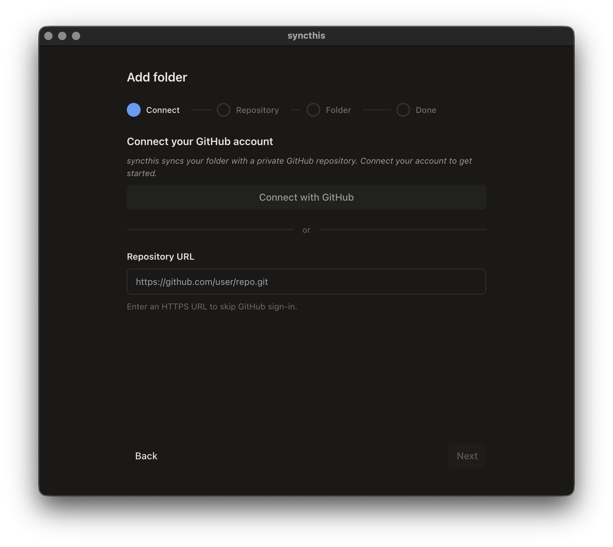
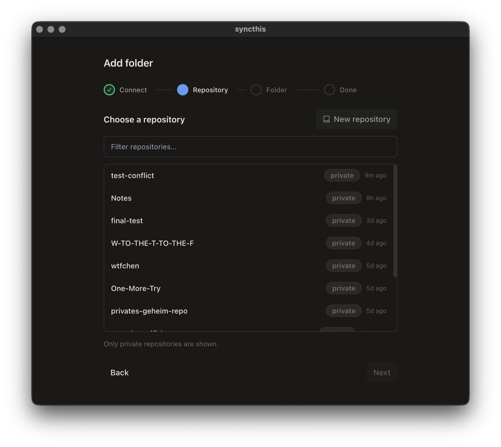
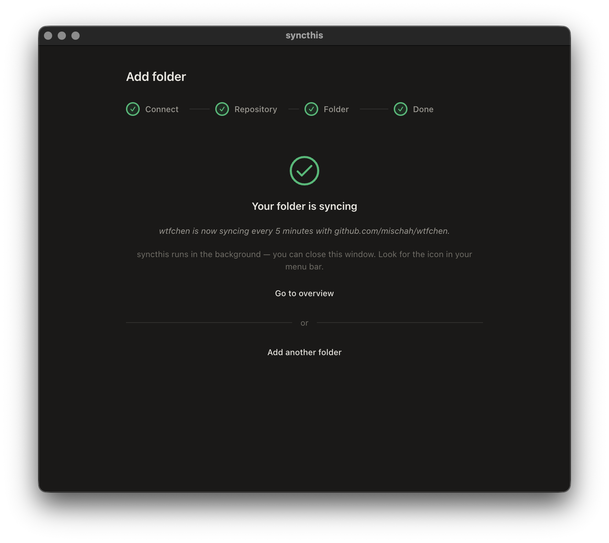
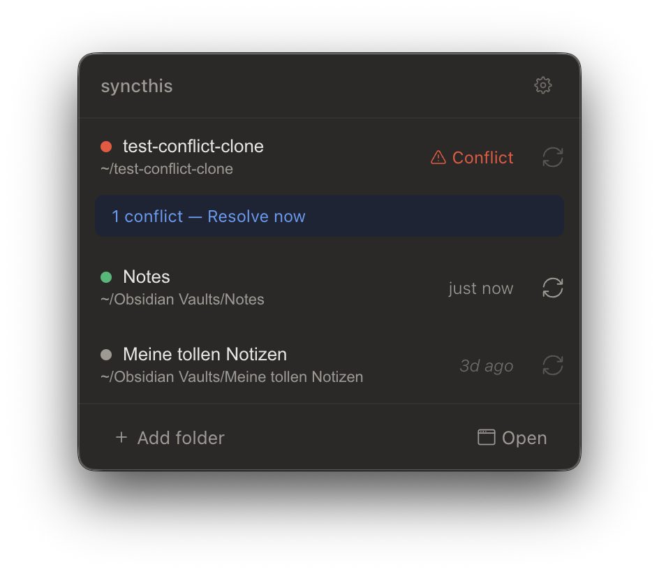
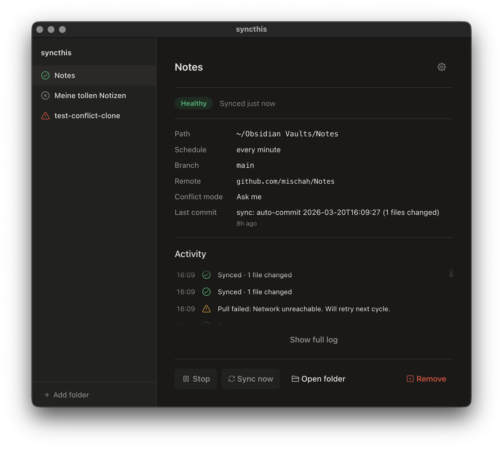

# Obsidian Sync Setup Guide

This guide walks you through setting up **syncthis** to keep your [Obsidian](https://obsidian.md) vault in sync across multiple devices — from scratch, no prior experience needed.

**What you'll end up with:** Your Obsidian notes automatically syncing to a private GitHub repository, across all your devices.

**Time required:** About 10 minutes for the first device. 5 minutes for each additional device.

---

## Table of Contents

1. [What Are Git and GitHub?](#1-what-are-git-and-github)
2. [Install Git](#2-install-git)
3. [Create a GitHub Account](#3-create-a-github-account)
4. [Set Up with the Desktop App](#4-set-up-with-the-desktop-app)
5. [Set Up Your Second Device](#5-set-up-your-second-device)
6. [Alternative: Command Line Setup](#6-alternative-command-line-setup)
7. [Troubleshooting](#7-troubleshooting)

---

## 1. What Are Git and GitHub?

**Git** is a version control system — think of it as a save-game system for your files. It keeps track of every change you've ever made, so you can always go back to a previous version.

**GitHub** is an online service that stores your Git repositories in the cloud. It's where your notes live when they're being synced between devices — like a secure locker that all your devices can access.

You don't need to understand how Git or GitHub work in detail. syncthis handles all of that for you. You just need a GitHub account. The desktop app includes Git — if you use the CLI, you'll need Git installed separately.

---

## 2. Install Git (CLI only)

> **Desktop app users:** You can skip this step. The desktop app bundles its own Git and will use your system Git automatically if available.

Git is the engine that syncthis uses under the hood. If you plan to use the CLI, you need it installed on every device you want to sync.

**Check if Git is already installed:**

Open a terminal (macOS: press **Cmd + Space**, type **Terminal**, press Enter — Linux: press **Ctrl + Alt + T**) and type:

```bash
git --version
```

If you see a version number (e.g. `git version 2.39.0`), you're good — skip to the next step.

**If Git is not installed:**

- **macOS:** The command above will prompt you to install the Xcode Command Line Tools. Click **Install** and wait for it to finish.
- **Linux (Debian/Ubuntu):** Run `sudo apt install git`
- **Linux (Fedora):** Run `sudo dnf install git`
- **Other systems:** Download from [git-scm.com/downloads](https://git-scm.com/downloads)

After installing, run `git --version` again to confirm.

---

## 3. Create a GitHub Account

If you already have a GitHub account, skip to the next step.

1. Go to [github.com/signup](https://github.com/signup)
2. Follow the steps to create a free account.
3. Verify your email address.

That's all you need — a free account is sufficient.

---

## 4. Set Up with the Desktop App

The desktop app includes a setup wizard that handles everything for you — no terminal needed.

### Download and install

1. Go to the [syncthis Releases page](https://github.com/mischah/syncthis/releases) and download the latest version for your platform.
2. Install the app:
   - **macOS:** Open the DMG and drag syncthis to Applications.
   - **Linux:** Install the `.deb` package or run the AppImage.

### Run the setup wizard

When you launch syncthis for the first time, the setup wizard opens automatically:

1. **Connect GitHub** — Click the button to sign in with your GitHub account. This authorizes syncthis to create and access repositories on your behalf.

   

2. **Choose a repository** — Select an existing repository or create a new private one for your vault.

   

3. **Pick your vault folder** — Select the local Obsidian vault folder you want to sync.

4. **Done!** — Sync starts automatically. syncthis now runs in your menu bar and keeps your vault in sync.

   

That's it. syncthis sits in your menu bar (macOS) or system tray (Linux) and syncs your vault in the background. You can click the tray icon anytime to see the current status:





---

## 5. Set Up Your Second Device

On each additional device:

1. Download and install the syncthis desktop app ([step 4](#4-set-up-with-the-desktop-app)).
3. Run the setup wizard — connect the same GitHub account and select the **same repository**.
4. Choose where to put the vault folder on this device.

syncthis clones your vault from GitHub and starts syncing. Open the folder in Obsidian, and you're done.

---

## 6. Alternative: Command Line Setup

If you prefer the terminal, syncthis is also available as a CLI tool. This requires [Node.js](https://nodejs.org) ≥ 20 and [SSH access to GitHub](https://docs.github.com/en/authentication/connecting-to-github-with-ssh).

```bash
npm install -g syncthis
cd /path/to/your/obsidian-vault
syncthis init --remote git@github.com:yourname/my-vault.git
syncthis start
```

See the [CLI documentation](../packages/cli/README.md) for the full reference.

---

## 7. Troubleshooting

### Sync conflicts

If the same file was changed on two devices at the same time, syncthis detects the conflict. In the desktop app, you'll see a notification and can resolve it visually with a side-by-side diff. With the CLI, the default strategy keeps both versions as conflict copies (e.g. `note.conflict-2025-03-04T14-30-00.md`).

### "command not found: syncthis" (CLI only)

Node.js or npm is not in your system PATH. Try closing and reopening your terminal. If that doesn't help, reinstall Node.js from [nodejs.org](https://nodejs.org).

### "Permission denied (publickey)" (CLI only)

Your SSH key is not set up correctly. Follow [GitHub's SSH guide](https://docs.github.com/en/authentication/connecting-to-github-with-ssh).

### Need more help?

- Check the [full documentation](https://github.com/mischah/syncthis#readme)
- [Open an issue](https://github.com/mischah/syncthis/issues) on GitHub
